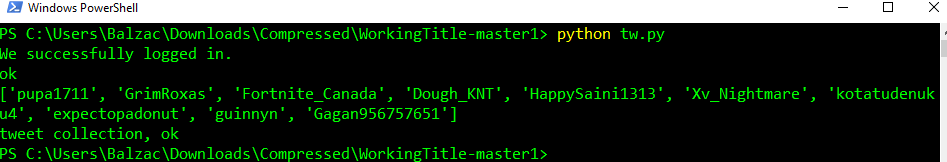
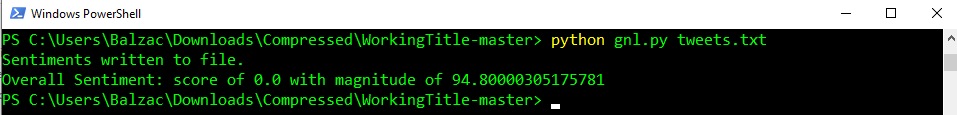
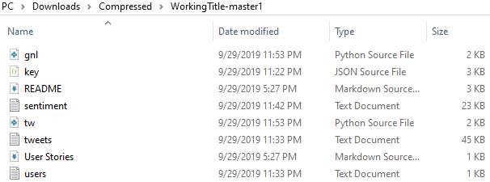
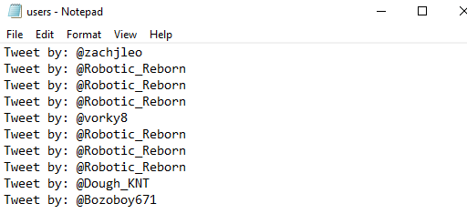
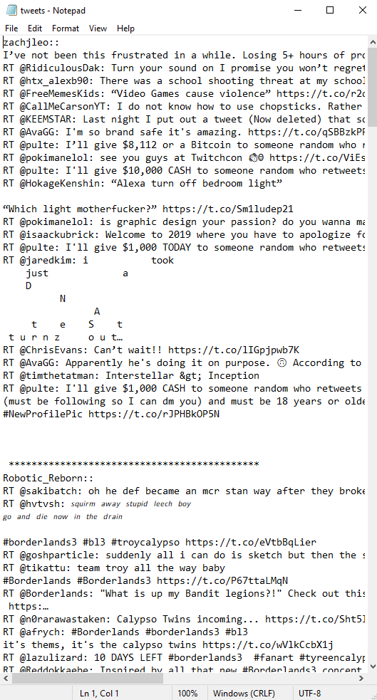
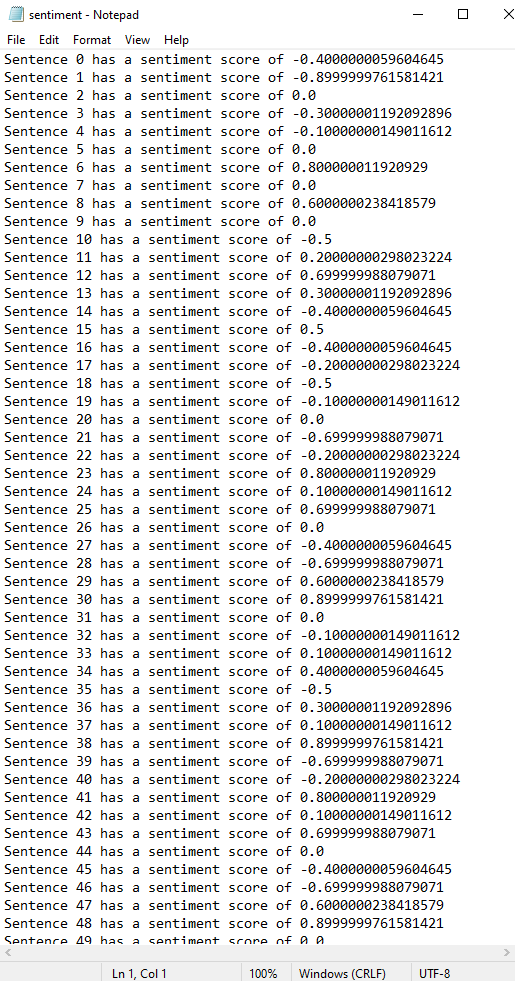

# WorkingTitle
### Product Mission - A tool for game studios to fix release day bugs by collecting criticism from Twitter accounts of players on the day of a new game release. <br/>


### Target Users - <br/>
The support team at a large game development studio. <br/>

### MVP - <br/>
Current scripts which generate a list of twitter users who have tweeted about a given #hashtag. Get and analyze their tweets for sentiment, and store negative sentiment tweets for further analysis. <br/>

### System Design - <br/>
There are two python scripts in this project, tw.py and gml.py. The first script gets a list of users who have posted a tweet with a particular #hashtag, such as the name of a newly released game, and stores their user names along with top tweets in two separate text files. We can specify the hashtag and the number of users to parse within the script.<br/>The second script parses the text file with the tweets to generate a sentiment score for each tweets in a third text file. This can then be analyzed further for negative tweets and mentions of bugs, which can be passed along to the QA team for patching.<br/>

### Dependencies - <br/>

pip, python, tweepy,gcloud sdk,git <br/>

You need to have a google cloud account with a project added and the Natural Language API enabled, instructions for those can be found [here](https://cloud.google.com/natural-language/docs/quickstarts). Also you need to have twitter authentication api keys, instructions for those can be found [here](https://tweepy.readthedocs.io/en/latest/auth_tutorial.html#auth-tutorial).<br/>

Install [Python](www.python.org), [Pip](https://pypi.org/project/pip/), [Tweepy](https://www.tweepy.org/), and [Git](https://git-scm.com/) for Linux or Mac or [this](https://gitforwindows.org/), if you're on Windows. Follow the instructions for your platform (Linux, Windows or MacOS).

### Steps to run the project - <br/>
1. Open a terminal window on Mac or Linux or a Powershell session in Windows and clone the repository by running ```git clone https://github.com/nihardwivedi/WorkingTitle.git``` in the directory where you want to run the project or download a zip file of the repository by clicking the download zip button at top right.<br/>
2. Navigate to the project folder by running ```cd WorkingTitle```. Paste the key.json file containing your api keys in this folder and also paste the twitter api keys in the tw.py file at the appropiate places. <br/>
3. In your terminal type ```python tw.py``` and hit enter. The script will get the top 10 users and generate text files containing their usernames and tweets in the same directory.<br/>
4. Next type ```python gnl.py``` and hit enter. The script will generate the sentiment scores for the tweets in a text file called sentiment.txt.<br/>
<br/>
5.Edit the tweepy.py file with your preferred values for the hashtag to search for ,the number of users to get, and the api keys.<br/>
You also need to store the key.json file containing the google cloud api keys in the same folder.

### Testing - <br/>
Used the scripts for default tests with the hashtag #Borderlands3 and number of users as 10. Got the text files for usernames, tweets and sentiment scores. <br/>


### Project Outcomes - <br/>
#### Lessons - <br/>
1. Building software is not easy. We ran into errors. We learnt to be patient.<br/>
2. Consistency is important. Doing work in regular and small increments is much easier than holding 5 hour code sprints before the deadline.<br/>
3.Documentation of the code is as important as the code itself. Poorly formatted, messy code without any accompanying documentation is a nightmare to work with. Proper documentation makes it easy for future developers to work on your code.<br/>

#### Personal Learnings - <br/>
#### 1. What I liked doing?<br/>
Nihar: I liked the team aspect of the project. Working alone might not have given me a new insight into the problems that arose. A new perspective helped me attack the problem from another angle, and ultimately helped me solve the problem.<br/>
Wei: New partners and challenges give me impulse. This is my first API programming project. Together with Nihar, I learned a lot of skills.<br/>

#### 2. What you could have done better?
Nihar: I should have held more meetings, which could have led to greater product finesse. We finished the project, after all in 3 meetings, and mainly worked alone on our own parts of the project.<br/>
Wei: We should have more communications and discussions with partners. And A clearer working plan.<br/>

#### 3. What you will avoid in the future?
Nihar: I will avoid jumping straight into coding without first having a plan, and without finalizing any architecture in place.<br/>
Wei: I will go online to search for more information and know more about APIs.<br/>
